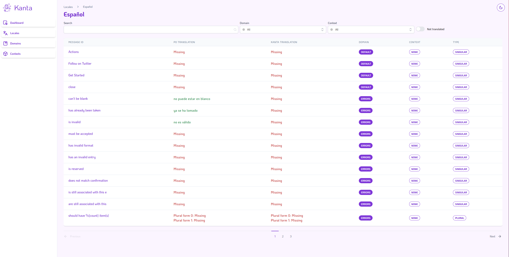

<a id="readme-top" name="readme-top"></a>
<br />

<div align="center">
  <a href="https://github.com/curiosum-dev/kanta">
    
  </a>
  <br />
  <br />
  <p style="margin-top: 3rem; font-size: 14pt;" align="center">
    User-friendly translations manager for Elixir/Phoenix projects.
    <br />
    <a href="https://kanta.curiosum.com">View Demo</a>
    ·
    <a href="https://github.com/curiosum-dev/kanta/issues">Report Bug</a>
    ·
    <a href="https://github.com/curiosum-dev/kanta/issues">Request Feature</a>
  </p>
</div>

<div>
  <a href="https://github.com/curiosum-dev/kanta/actions/workflows/development.yml">
    
  </a>
  <a href="https://hex.pm/packages/kanta">
    
  </a>
  <a href="https://hexdocs.pm/kanta">
    
  </a>
</div>

<br/>

<ul style="margin-top: 3rem; margin-bottom: 3rem;">
  <li>
    <a href="#about-the-project">About The Project</a>
  </li>
  <li>
    <a href="#getting-started">Getting Started</a>
    <ul>
      <li><a href="#prerequisites">Prerequisites</a></li>
      <li><a href="#installation">Installation</a></li>
      <li><a href="#configuration">Configuration</a></li>
      <li><a href="#database-migrations">Database Migrations</a></li>
      <li><a href="#gettext-module">Gettext Module</a></li>
      <li><a href="#kanta-supervisor">Kanta Supervisor</a></li>
      <li><a href="#kanta-ui">Kanta UI</a></li>
    </ul>
  </li>
  <li>
    <a href="#features">Features</a>
    <ul>
      <li><a href="#extracting-from-po-files">Extracting from PO files</a></li>
      <li><a href="#storing-messages-in-the-database">Storing messages in the database</a></li>
      <li><a href="#translation-progress">Translation progress</a></li>
    </ul>
  </li>
  <li>
    <a href="#plugins">Plugins</a>
    <ul>
      <li><a href="#po-writer">PO Writer</a></li>
      <li><a href="#deepl">DeepL</a></li>
      <li><a href="#kantasync">Translation synchronization</a></li>
    </ul>
  </li>
  <li><a href="#roadmap">Roadmap</a></li>
  <li>
    <a href="#development">Development</a>
    <ul>
      <li><a href="#running-tests">Running Tests</a></li>
    </ul>
  </li>
  <li><a href="#contributing">Contributing</a></li>
  <li><a href="#license">License</a></li>
  <li><a href="#contact">Contact</a></li>
  <li><a href="#acknowledgments">Acknowledgments</a></li>
</ul>

---

_Note: Official documentation for Kanta library is [available on hexdocs][hexdoc]._

[hexdoc]: https://hexdocs.pm/kanta

---

<br />

# About The Project

If you're working on an Elixir/Phoenix project and need to manage translations, you know how time-consuming and error-prone it can be. That's where Kanta comes in. Our tool simplifies the process of managing translations by providing an intuitive interface for adding, editing, and deleting translations. Our tool also makes it easy to keep translations up-to-date as your project evolves. With Kanta, you can streamline your workflow and focus on building great software, not managing translations.

<p align="right">(<a href="#readme-top">back to top</a>)</p>

# Getting Started

## Prerequisites

- Elixir (tested on 1.14.0)
- Phoenix (tested on 1.7.0)
- Ecto SQL (tested on 3.6)
- Phoenix LiveView 0.18.0+
- Gettext 0.26.0+
- PostgreSQL 15+ or SQLite 3.31.0+

## Installation

The package can be installed
by adding `kanta` to your list of dependencies in `mix.exs`:

```elixir
def deps do
  [
    {:kanta, "~> 0.4.1"},
    {:gettext, git: "git@github.com:ravensiris/gettext.git", branch: "runtime-gettext"}
  ]
end
```

The dependency on this specific `gettext` version is because this library depends on an in-progress feature, to be included in a future release of `gettext` (see discussion in elixir-gettext/gettext#280 and pull request elixir-gettext/gettext#305). As of March 2023, this has been approved by an Elixir core team member, so we are eagerly awaiting for it being merged upstream.

## Configuration

Add to `config/config.exs` file:

```elixir
# config/config.exs
config :my_app, Kanta,
  endpoint: MyAppWeb.Endpoint, # Your app Endpoint module
  repo: MyApp.Repo, # Your app Repo module
  otp_name: :my_app, # Name of your OTP app
  plugins: []
```

Ecto repo module is used mostly for translations persistency. We also need endpoint to use VerifiedRoutes and project_root to locate the project's .po files.

## Database migrations

Migrations is heavily inspired by the Oban approach. To add to the project tables necessary for the operation of Kanta and responsible for storing translations create migration with:

```bash
mix ecto.gen.migration add_kanta_translations_table
```

Open the generated migration file and set up `up` and `down` functions.

### PostgreSQL

```elixir
defmodule MyApp.Repo.Migrations.AddKantaTranslationsTable do
  use Ecto.Migration

  def up do
    Kanta.Migration.up(version: 4)
  end

  # We specify `version: 1` because we want to rollback all the way down including the first migration.
  def down do
    Kanta.Migration.down(version: 1)
  end
end
```

### SQLite3

```elixir
defmodule MyApp.Repo.Migrations.AddKantaTranslationsTable do
  use Ecto.Migration

  def up do
    Kanta.Migration.up(version: 3)
  end

  # We specify `version: 1` because we want to rollback all the way down including the first migration.
  def down do
    Kanta.Migration.down(version: 1)
  end
end
```

after that run

```bash
mix ecto.migrate
```

## Gettext module

Configuring Gettext requires just a single change.

Wherever you have:

```elixir
use Gettext, backend: YourApp.Gettext
```

replace it with:

```elixir
use Kanta.Gettext, backend: YourApp.Gettext
```

If you're using a Gettext version lower than 0.26, refer to the [official documentation](https://github.com/elixir-gettext/gettext) for migration instructions.

## Kanta Supervisor

In the `application.ex` file of our project, we add Kanta and its configuration to the list of processes.

```elixir
  def start(_type, _args) do
    children = [
      ...
      {Kanta, Application.fetch_env!(:my_app, Kanta)}
      ...
    ]
    ...
  end
```

## Kanta UI

Inside your `router.ex` file we need to connect the Kanta panel using the kanta_dashboard macro.

```elixir
import KantaWeb.Router

scope "/" do
  pipe_through :browser

  kanta_dashboard("/kanta")
end
```

<p align="right">(<a href="#readme-top">back to top</a>)</p>

# Features

## Extracting from PO files



Kanta is based on the Phoenix Framework's default localization tool, GNU gettext. The process, which runs at application startup, analyzes .po files with messages and converts them to a format for convenient use with Ecto and Kanta itself.

## Storing messages in the database


Messages and translations from .po files are stored in tables created by the Kanta.Migration module. This allows easy viewing and modification of messages from the Kanta UI or directly from database tools. The caching mechanism prevents constant requests to the database when downloading translations, so you don't have to worry about a delay in application performance.

## Translation progress


Kanta tracks the progress of your application's translation into other languages and reports it in the user's dashboard. In the dashboard you can filter your messages by domain or context, or use a search engine. It is also possible to display only the messages that need translation to better see how much work remains to be done.

<p align="right">(<a href="#readme-top">back to top</a>)</p>

# Plugins

## DeepL

Not all of us are polyglots, and sometimes we need the help of machine translation tools. For this reason, we have provided plug-ins for communication with external services that will allow you to translate texts into another language without knowing it. As a first step, we introduced integration with DeepL API offering 500,000 characters/month for free and more in paid plans. To use DeepL API add `{:kanta_deep_l_plugin, "~> 0.1.1"}` to your `deps` and append `Kanta.DeepL.Plugin` to the list of plugins along with the API key from your account at DeepL. New features will then be added to the Kanta UI that will allow you to translate using this tool.


```elixir
# mix.exs
defp deps do
  ...
  {:kanta_deep_l_plugin, "~> 0.1.1"}
end
```

```elixir
# config/config.exs
config :kanta,
  ...
  plugins: [
    {Kanta.DeepL.Plugin, api_key: "YOUR_DEEPL_API_KEY"}
  ]
```

## KantaSync

The [KantaSync plugin](https://github.com/curiosum-dev/kanta_sync_plugin) allows you to synchronize translations between your production and staging/dev environments. It ensures that any changes made to translations in one are reflected in the others, helping you maintain consistency across different stages of development.

```elixir
# mix.exs
defp deps do
  ...
  {:kanta_sync_plugin, "~> 0.1.0"}
end
```

You need to have Kanta API configured by using kanta_api macro.

```elixir
# router.ex
import KantaWeb.Router

scope "/" do
  kanta_api("/kanta-api")
end
```

### Authorization

Set `KANTA_SECRET_TOKEN` environment variable for restricting API access. It should be generated with `mix phx.gen.secret 256` and both environments must have the same `KANTA_SECRET_TOKEN` environment variables.

You can also disable default authorization mechanism and use your own, by passing `disable_api_authorization: true` option into Kanta's config.

## PO Writer

Kanta was created to allow easy management of static text translations in the application, however, for various reasons like wanting a backup or parallel use of other tools like TMS etc. you may want to overwrite .po files with translations entered in Kanta. To install it append `{:kanta_po_writer_plugin, git: "https://github.com/curiosum-dev/kanta_po_writer_plugin"}` to your `deps` list. Currently, it's not on Hex because it's in a pre-release version. Then add `Kanta.Plugins.POWriter` to the list of plugins, and new functions will appear in the Kanta UI to allow writing to .po files.

```elixir
# mix.exs
defp deps
  ...
  {:kanta_po_writer_plugin, git: "https://github.com/curiosum-dev/kanta_po_writer_plugin"},
end
```

```elixir
# config/config.exs
config :kanta,
  ...
  plugins: [
    Kanta.POWriter.Plugin
  ]
```

<p align="right">(<a href="#readme-top">back to top</a>)</p>

## Roadmap

- [ ] Typespecs, tests, better docs
- [ ] CI/CD
- [ ] Gettext extract/merge automation
- [ ] Google Translate, Yandex Translate, LibreTranslate Plugins
- [ ] File import/export
- [ ] Bumblebee AI translations
- [ ] REST API

See the [open issues](https://github.com/curiosum-dev/kanta/issues) for a full list of proposed features (and known issues).

<p align="right">(<a href="#readme-top">back to top</a>)</p>

# Development

## Running Tests

If you're contributing to Kanta development, you'll need to run the test suite. The tests require a PostgreSQL database.

### Prerequisites for Development
- PostgreSQL 15+ (for running tests)
- All prerequisites listed in [Getting Started](#prerequisites)

### Test Setup

First-time setup (or if tests are failing due to database issues):

```bash
# Setup test database and run migrations
MIX_ENV=test mix ecto.drop && MIX_ENV=test mix ecto.create && MIX_ENV=test mix ecto.migrate
```

<!-- CONTRIBUTING -->

## Contributing

Contributions are what make the open source community such an amazing place to learn, inspire, and create. Any contributions you make are **greatly appreciated**.

If you have a suggestion that would make this better, please fork the repo and create a pull request. We prefer gitflow and Conventional commits style but we don't require that. You can also simply open an issue with the tag "enhancement".
Don't forget to give the project a star! Thanks again!

1. Fork the Project
2. Create your Feature Branch (`git checkout -b feature/AmazingFeature`)
3. Commit your Changes (`git commit -m 'feat: Add some AmazingFeature'`)
4. Push to the Branch (`git push origin feature/AmazingFeature`)
5. Open a Pull Request

<p align="right">(<a href="#readme-top">back to top</a>)</p>

<!-- LICENSE -->

## License

Distributed under the MIT License. See `LICENSE.txt` for more information.

<p align="right">(<a href="#readme-top">back to top</a>)</p>

<!-- CONTACT -->

## Contact

[Curiosum](https://curiosum.com)

Michał Buszkiewicz - michal@curiosum.com

Krzysztof Janiec - krzysztof.janiec@curiosum.com

Artur Ziętkiewicz - artur.zietkiewicz@curiosum.com

<p align="right">(<a href="#readme-top">back to top</a>)</p>
