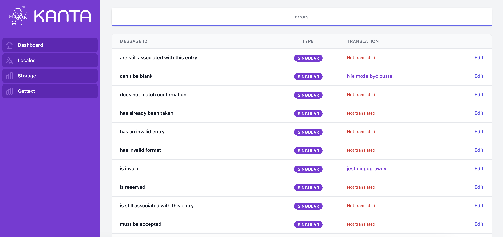

<a name="readme-top"></a>

<!-- PROJECT LOGO -->
<br />
<div align="center">
  <a href="https://github.com/curiosum-dev/kanta">
    
  </a>

  <p align="center">
    User-friendly translations manager for Elixir/Phoenix projects.
    <br />
    <a href="https://github.com/curiosum-dev/kanta/DOCS.md"><strong>Explore the docs »</strong></a>
    <br />
    <br />
    <a href="#">View Demo</a>
    ·
    <a href="https://github.com/curiosum-dev/kanta/issues">Report Bug</a>
    ·
    <a href="https://github.com/curiosum-dev/kanta/issues">Request Feature</a>
  </p>
</div>

<!-- TABLE OF CONTENTS -->
<details>
  <summary>Table of Contents</summary>
  <ol>
    <li>
      <a href="#about-the-project">About The Project</a>
    </li>
    <li>
      <a href="#getting-started">Getting Started</a>
      <ul>
        <li><a href="#prerequisites">Prerequisites</a></li>
        <li><a href="#installation">Installation</a></li>
      </ul>
    </li>
    <li><a href="#usage">Usage</a></li>
    <li><a href="#roadmap">Roadmap</a></li>
    <li><a href="#contributing">Contributing</a></li>
    <li><a href="#license">License</a></li>
    <li><a href="#contact">Contact</a></li>
    <li><a href="#acknowledgments">Acknowledgments</a></li>
  </ol>
</details>

<!-- ABOUT THE PROJECT -->

## About The Project



TODO

<p align="right">(<a href="#readme-top">back to top</a>)</p>

# Getting Started

## Prerequisites

- Elixir/Phoenix project
- Database setup

## Installation

The package can be installed
by adding `kanta` to your list of dependencies in `mix.exs`:

```elixir
def deps do
  [
    {:kanta, "~> 0.1.0"},
    {:gettext, git: "git@github.com:bamorim/gettext.git", branch: "runtime-gettext"}
  ]
end
```

The dependency on this specific `gettext` version is because this library depends on an in-progress feature, to be included in a future release of `gettext` (see discussion in elixir-gettext/gettext#280 and pull request elixir-gettext/gettext#305). As of March 2023, this has been approved by an Elixir core team member, so we are eagerly awaiting for it being merged upstream.
### Add configuration

Add to `config/config.exs` file:

```elixir
# config/config.exs
config :kanta,
  ecto_repo: MyApp.Repo,
  project_root: File.cwd!()
```

Ecto repo is used for translations persistency.

### Create migration

Create migration with

```bash
mix ecto.gen.migration add_kanta_translations_table
```

Open the generated migration file and set up `up` and `down` functions:

```elixir
defmodule MyApp.Repo.Migrations.AddKantaTranslationsTable do
  use Ecto.Migration

  def up do
    Kanta.Migrations.up()
  end

  def down do
    Kanta.Migrations.down()
  end
end
```

And run

```bash
mix ecto.migrate
```

### Adjust Gettext module

Add Kanta Repo as a default translation repository inside your Gettext module.

```elixir
use Gettext, ..., repo: Kanta.Gettext.Repo
```

### Setup Kanta UI

Inside your `router.ex` file forward desired path to the KantaWeb.Router.

```elixir
scope "/" do
  pipe_through :browser
  forward "/kanta", KantaWeb.Router
end
```

<p align="right">(<a href="#readme-top">back to top</a>)</p>

<!-- USAGE EXAMPLES -->

# Usage

1. Start Phoenix server and visit `localhost:4000/kanta` (or otherpath you've set in the router.ex file).
2. From there you can check and modify your translations from already existing .po files.

TODO

<p align="right">(<a href="#readme-top">back to top</a>)</p>

<!-- ROADMAP -->

## Roadmap

- [x] Support plural translations
- [x] Normalize database
- [ ] Add documentation and typespecs

See the [open issues](https://github.com/curiosum-dev/kanta/issues) for a full list of proposed features (and known issues).

<p align="right">(<a href="#readme-top">back to top</a>)</p>

<!-- CONTRIBUTING -->

## Contributing

Contributions are what make the open source community such an amazing place to learn, inspire, and create. Any contributions you make are **greatly appreciated**.

If you have a suggestion that would make this better, please fork the repo and create a pull request. We prefer gitflow and Conventional ommits style but we don't require that. You can also simply open an issue with the tag "enhancement".
Don't forget to give the project a star! Thanks again!

1. Fork the Project
2. Create your Feature Branch (`git checkout -b feature/AmazingFeature`)
3. Commit your Changes (`git commit -m 'feat: Add some AmazingFeature'`)
4. Push to the Branch (`git push origin feature/AmazingFeature`)
5. Open a Pull Request

<p align="right">(<a href="#readme-top">back to top</a>)</p>

<!-- LICENSE -->

## License

Distributed under the MIT License. See `LICENSE.txt` for more information.

<p align="right">(<a href="#readme-top">back to top</a>)</p>

<!-- CONTACT -->

## Contact

Michał Buszkiewicz - michal@curiosum.com

Krzysztof Janiec - krzysztof.janiec@curiosum.com

Artur Ziętkiewicz - artur.zietkiewicz@curiosum.com

<p align="right">(<a href="#readme-top">back to top</a>)</p>
