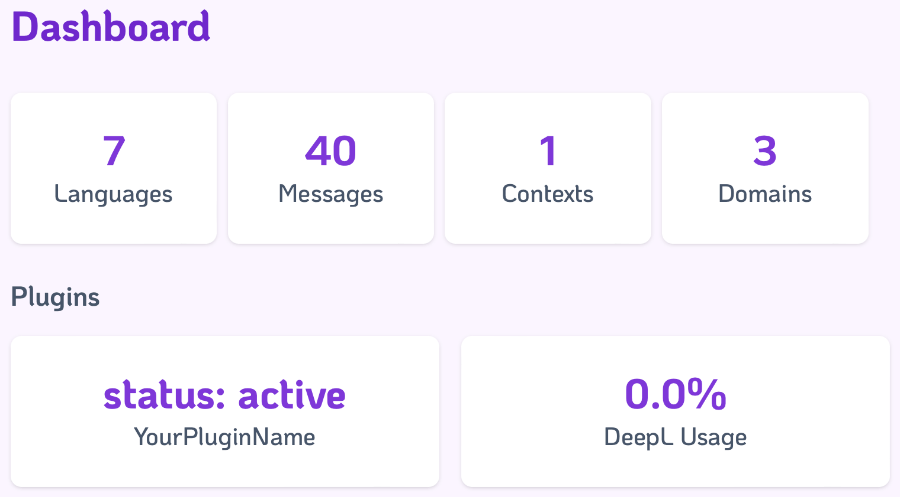
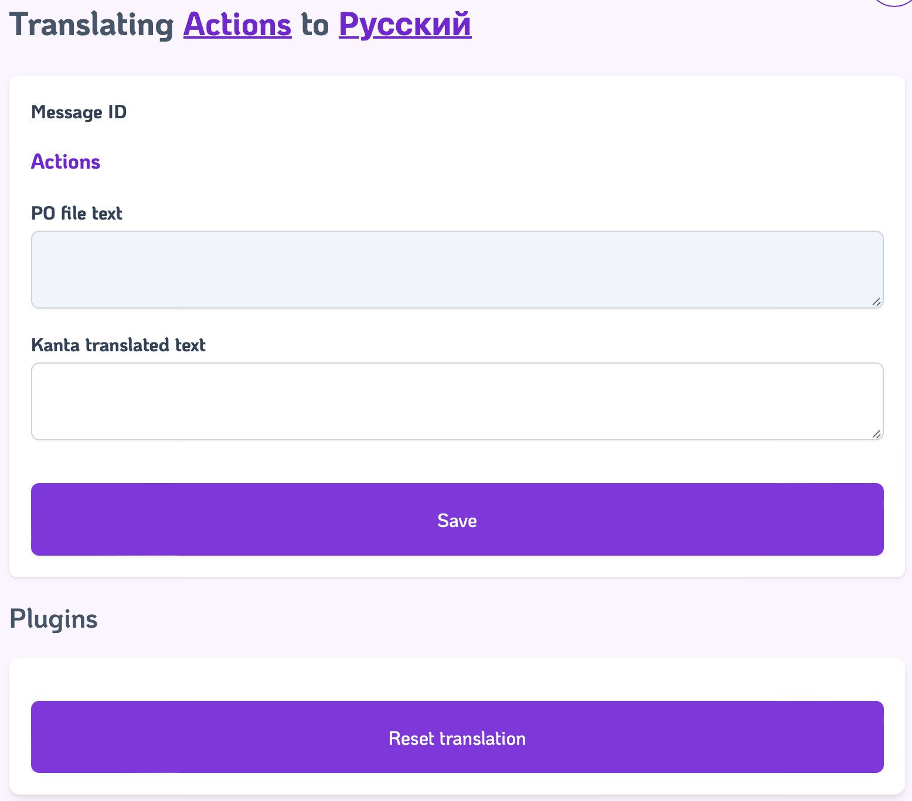

# How to write plugins?

Kanta allows you to expand its core features using plugins.

A plugin refers to any module that initiates a process and exposes a `start_link/1` function. During startup, Kanta automatically inserts each plugin into its supervision tree.

Plugins have the capability to enhance Kanta's user interface by defining their own Phoenix components.

At Curiosum, we currently maintain two plugins:

- [DeepL Plugin](https://github.com/curiosum-dev/kanta_deep_l_plugin)
- [PO Writer Plugin](https://github.com/curiosum-dev/kanta_po_writer_plugin)

Feel welcome to explore their code for a deeper understanding of their setup.

## Getting started

The first thing you have to do after creating brand new mix project is a module which name will be an entry point for your plugin. It also must contain a GenServer that will be added to Kanta's supervisor.

```bash
mix new your_plugin_name
```

**lib/your_plugin_name.ex**:

```elixir
defmodule YourPluginName do
  @moduledoc """
  Kanta YourPluginName integration plugin
  """

  use GenServer

  def start_link(opts) do
    GenServer.start_link(__MODULE__, opts, name: opts[:name])
  end

  def init(_opts) do
    {:ok, %{}}
  end
end
```

Let's add this custom plugin to your testing app that uses Kanta.
For a smooth initiation, we've got your back with our [kanta-example-app](https://github.com/curiosum-dev/kanta-example-app). Use it as the foundation for your testing app that incorporates Kanta and your custom plugin.

First, add your plugin to `deps` list, then to Kanta's `plugins` config.

**mix.exs**:

```
defp deps do
    # ...
    {:your_plugin_name, path: "../your_plugin_name"}
end
```

**config/config.exs**:

```
config :kanta_test, Kanta,
  plugins: [
    {YourPluginName, []}
  ]
```

## Tweaking UI

First, add `phoenix_live_view` and `kanta` to your plugins deps:

**mix.exs**:

```elixir
defp deps do
[
    {:phoenix_live_view, "~> 0.18"},
    {:kanta, ">= 0.1.3"},
]
end
```

### Adding panel to dashboard

With a simple creation of a component named `YourPluginName.DashboardComponent`, you can seamlessly integrate your plugin's panel into the Kanta dashboard. The components name plays a crucial role, because it's derived from the module name passed in the configuration file's `plugins` list.

**lib/dashboard_component**:

```elixir
defmodule YourPluginName.DashboardComponent do
  @moduledoc """
  Phoenix LiveComponent for Kanta dashboard
  """

  use Phoenix.LiveComponent

  def render(assigns) do
    ~H"""
      <div class="col-span-2">
        <div class="bg-white dark:bg-stone-900 overflow-hidden shadow rounded-lg">
          <div class="flex flex-col items-center justify-center px-4 py-5 sm:p-6">
            <div class="text-3xl font-bold text-primary dark:text-accent-light">status: <%= @status %></div>
            <div class="text-slate-600 dark:text-content-light font-medium text-lg">YourPluginName</div>
          </div>
        </div>
      </div>
    """
  end

  def update(assigns, socket) do
    socket = assign(socket, :status, "active")

    {:ok, assign(socket, assigns)}
  end
end
```



#### Need async or more control over the process?
You can use `DashboardLive` instead. Which would render as a child live view.
This way you can write async code and have a separate process for your component.
**lib/dashboard_live**:

```elixir
defmodule YourPluginName.DashboardLive do
  @moduledoc """
  Phoenix child live view for Kanta dashboard
  """

  use Phoenix.LiveView, container: {:div, style: "grid-column: 1 / -1;"}

  @impl true
  def render(assigns) do
   ~H""" 
    <div class="bg-white dark:bg-stone-900 overflow-hidden shadow rounded-lg">
      <div class="flex flex-col items-center justify-center px-4 py-5 sm:p-6">
        <div class="text-3xl font-bold text-primary dark:text-accent-light">status: <%= @status %></div>
        <div class="text-slate-600 dark:text-content-light font-medium text-lg">YourPluginName</div>
      </div>
    </div>
    """
  end

  @impl true
  def mount(_params, _session, socket) do
    {:ok, socket}
  end
end
```

### Adding custom form to translation edit view

Enhance the translation edit view with a touch of personalization, by creating a component named `YourPluginName.FormComponent`.

**lib/form_component.ex**:

```elixir
defmodule YourPluginName.FormComponent do
  @moduledoc """
  Phoenix LiveComponent for Kanta translation form
  """

  use Phoenix.LiveComponent

  alias Kanta.Translations
  alias Kanta.Translations.Message

  def render(assigns) do
    ~H"""
      <div>
        <.form phx-submit="submit" phx-target={@myself} class="space-y-4">
          <button type="submit" class="col-span-1 w-full flex items-center justify-center px-4 py-4 mt-4 border border-transparent rounded-md shadow-sm text-sm font-medium text-white bg-primary dark:bg-accent-dark hover:bg-primary-dark hover:dark:bg-accent-light focus:outline-none focus:ring-2 focus:ring-offset-2 focus:ring-offset-slate-800 focus:ring-primary focus:dark:ring-accent-dark">
            Reset translation
          </button>
        </.form>
      </div>
    """
  end

  def handle_event(
        "submit",
        _,
        %{assigns: %{message: %Message{message_type: :singular}}} = socket
      ) do
    translation = socket.assigns.translation
    Translations.update_singular_translation(translation, %{"translated_text" => ""})
    {:noreply, socket}
  end

  def handle_event(
        "submit",
        _,
        %{assigns: %{message: %Message{message_type: :plural}}} = socket
      ) do
    translation = socket.assigns.translation
    Translations.update_plural_translation(translation, %{"translated_text" => ""})
    {:noreply, socket}
  end
end
```



Kanta passes keyword list with values that you can use inside your component:

- `id` - name of your plugin
- `message` - `Kanta.Translations.Message` struct, for example

  ```elixir
  %Kanta.Translations.Message{
    id: 1,
    msgid: "Actions",
    message_type: :singular,
    domain_id: 1,
    domain: #Ecto.Association.NotLoaded<association :domain is not loaded>,
    context_id: nil,
    context: #Ecto.Association.NotLoaded<association :context is not loaded>,
    singular_translations: #Ecto.Association.NotLoaded<association :singular_translations is not loaded>,
    plural_translations: #Ecto.Association.NotLoaded<association :plural_translations is not loaded>,
    inserted_at: ~N[2023-08-02 10:19:57],
    updated_at: ~N[2023-08-02 10:19:57]
  }
  ```

- `locale` - `Kanta.Translations.Locale` struct, for example:

  ```elixir
  %Kanta.Translations.Locale{
      id: 4,
      iso639_code: "it",
      name: "Italian",
      native_name: "Italiano",
      family: "Indo-European",
      wiki_url: "https://en.wikipedia.org/wiki/Italian_language",
      plurals_header: "nplurals=2; plural=(n != 1);",
      colors: ["#499348", "#FFFFFF", "#CF3737"],
      singular_translations: #Ecto.Association.NotLoaded<association :singular_translations is not loaded>,
      inserted_at: ~N[2023-08-02 10:19:57],
      updated_at: ~N[2023-08-02 10:19:57]
    }
  ```

- `translation` - either `Kanta.Translations.SingularTranslation` or `Kanta.Translations.PluralTranslation`, for example

  ```elixir
  %Kanta.Translations.SingularTranslation{
    id: 91,
    original_text: nil,
    translated_text: "Azioni",
    locale_id: 4,
    locale: #Ecto.Association.NotLoaded<association :locale is not loaded>,
    message_id: 1,
    message: #Ecto.Association.NotLoaded<association :message is not loaded>,
    inserted_at: ~N[2023-08-02 10:19:57],
    updated_at: ~N[2023-08-02 12:30:29]
  }
  ```

## Passing credentials or API keys

Securely power your plugin with credentials or API keys. As the second tuple element in the plugins list, you can conveniently pass additional information to further elevate your plugin's capabilities.

**config/config.exs**:

```
config :kanta_test, Kanta,
  plugins: [
    {YourPluginName, [credentials: %{token: :curiosum}]}
  ]
```

Then they can be accessed inside your plugin with

```elixir
defp get_credentials do
    case Enum.find(Kanta.config().plugins, &(elem(&1, 0) == YourPluginName)) do
      nil -> raise "missing credentials"
      {_, config} -> Keyword.get(config, :credentials)
    end
end
```

## Kanta internal API

Kanta revolves around the finders, handlers, services, and values pattern. This pattern boosts coding efficiency. Learn more: [Four Patterns to Save your Codebase and your Sanity](https://remote.com/blog/introducing-phx_gen_solid#finders-handlers-services-and-values).
